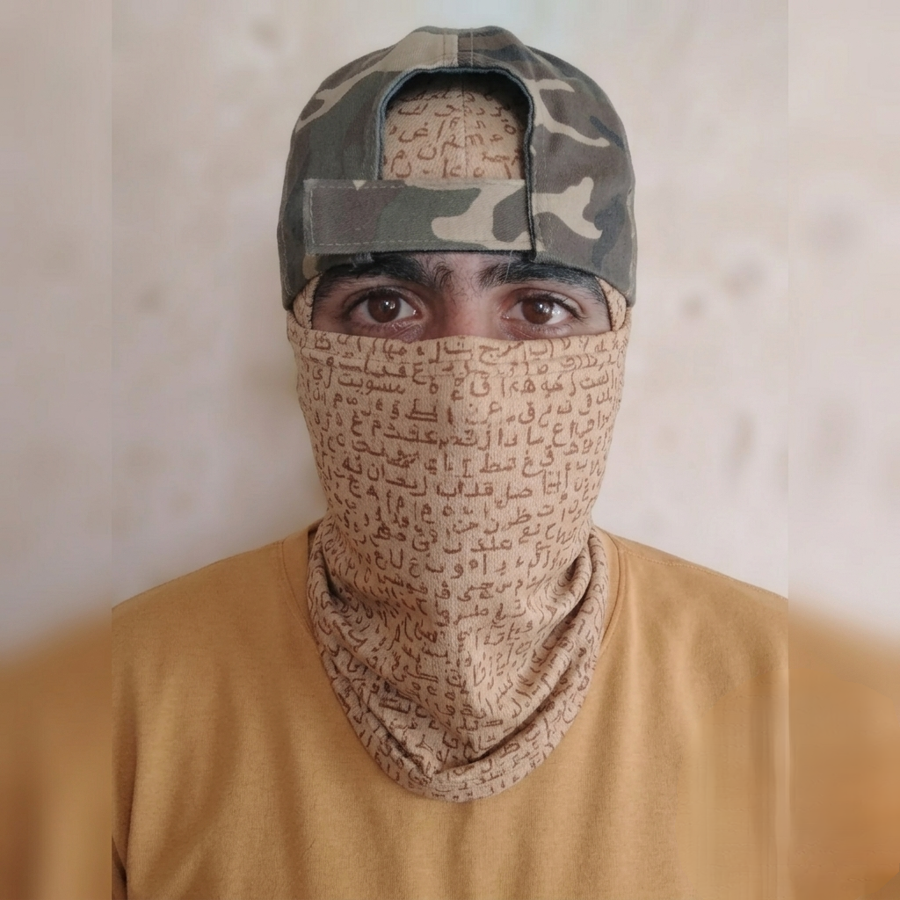

<html lang="ar" dir="rtl">
<head>
    <meta charset="UTF-8">
    <meta name="viewport" content="width=device-width, initial-scale=1.0">
    <title>RICK | Cyber Security Researcher</title>
    
    <link rel="preconnect" href="https://fonts.googleapis.com">
    <link rel="preconnect" href="https://fonts.gstatic.com" crossorigin>
    <link href="https://fonts.googleapis.com/css2?family=Cairo:wght=300;400;700&display=swap" rel="stylesheet">
    
    <link rel="stylesheet" href="https://cdnjs.cloudflare.com/ajax/libs/font-awesome/6.5.1/css/all.min.css">
    
    
</head>
<body>

    

        

            
> Initializing visitor integrity scan...

            
> Checking browser session structures...

            
> IP Routing Protocol: 172.217.16.14 verified.

            
> Injecting anti-bot token tracking...

            
> [SUCCESS] Cookies set. Access granted!

            

                🍪 Active Browser Cookie: None
            

        

    

    <header>
        

            

                
[ RICK ]

                <button class="header-follow-btn" onclick="activateFollow()">[ Follow ]</button>
                <button class="nav-video-toggle" onclick="toggleView()">
                    <i class="fa-solid fa-video"></i> [ المقاطع ]
                </button>
                <button class="nav-users-btn" onclick="openUsersModal()">
                    <i class="fa-solid fa-users"></i> [ المستخدمين ]
                </button>
            

            
<i class="fa-solid fa-bars"></i>

            <nav>
                <ul id="nav-list">
                    <li><a href="#home" onclick="resetToHome()">الرئيسية</a></li>
                    <li><a href="#about" onclick="resetToHome()">من أنا</a></li>
                    <li><a href="#services" onclick="resetToHome()">الخدمات</a></li>
                    <li><a href="#skills" onclick="resetToHome()">المهارات</a></li>
                    <li><a href="#contact" onclick="resetToHome()">اتصال</a></li>
                </ul>
            </nav>
        

    </header>

    

        <section id="home" class="hero">
            
            

                <h1>مرحباً، أنا Reck</h1>
                
>_ Cybersecurity Researcher & Ethical Hacker

                <a href="#contact" class="btn">اطلب فحص أمني الآن</a>
            

        </section>

        <section id="about">
            
من أنا

            

                

                    

                        <i class="fa-solid fa-user-shield"></i>
                    

                

                

                    <h2>الباحث الأمني RICK</h2>
                    
متخصص في اختبار الاختراق واكتشاف الثغرات الأمنية في تطبيقات الويب وأنظمة الشبكات. أعمل على تقديم حلول واستشارات أمنية متقدمة لحماية البيانات وتأمين البنى التحتية الرقمية من التهديدات السيبرانية المتطورة.

                

            

        </section>

        <section id="services">
            
الخدمات الأمنية

            

                

                    <i class="fa-solid fa-shield-halved"></i>
                    <h3>اختبار الاختراق</h3>
                    
محاكاة الهجمات السيبرانية الحقيقية لتحديد نقاط الضعف في التطبيقات والأنظمة قبل استغلالها.

                

                

                    <i class="fa-solid fa-bug"></i>
                    <h3>تحليل الكود الأمني</h3>
                    
مراجعة شاملة للأكواد البرمجية البرمجيات للتأكد من خلوها من الأخطاء المنطقية والثغرات.

                

                

                    <i class="fa-solid fa-lock"></i>
                    <h3>الاستشارات والدعم</h3>
                    
تقديم استراتيجيات أمنية متكاملة للشركات والأفراد لتعزيز خطوط الدفاع الرقمية.

                

            

        </section>

        <section id="skills">
            
المهارات التقنية

            

                Web Pentesting
                Network Security
                Vulnerability Assessment
                Linux System Admin
                Python Scripting
                Reverse Engineering
            

        </section>

        <section id="contact">
            
اتصال وتفاعل

            

                
إذا كنت بحاجة إلى استشارة أمنية أو تود الإبلاغ عن مشكلة، لا تتردد في مراسلتي.

                

                    <a href="mailto:mmellouk586@gmail.com"><i class="fa-solid fa-envelope"></i></a>
                    <a href="#"><i class="fa-brands fa-github"></i></a>
                    <a href="#"><i class="fa-brands fa-linkedin"></i></a>
                

            

        </section>
    

    <!-- قسم المقاطع الديناميكية المصلح مع تشغيل فيديو VID20260710115227.mp4 -->
    

        <h2 class="section-title">المقاطع الحصرية</h2>
        

            

                

                    <video src="VID20260710115227.mp4" controls preload="auto" playsinline></video>
                

                
استعراض حظر وفحص سلامة الأنظمة والتطبيقات

                

                    <strong><i class="fa-solid fa-language"></i> الترجمة المضافة:</strong>
                    مرحباً بكم في هذا المقطع التوضيحي الذي نستعرض فيه آليات الحماية المتقدمة وكيفية فحص وإدارة الجلسات بشكل آمن تماماً ضد الثغرات المتطورة.
                

            

        

    

    <!-- زر المحاكي العائم -->
    <button class="lab-float-btn" onclick="openLabModal()">
        <i class="fa-solid fa-terminal"></i> Security Lab
    </button>

    <!-- نافذة المحاكي السيبراني -->
    

        

            

                

                    

                        

                    

                    
rick@cyber-lab:~

                

                

                    

                        

                            Welcome to RICK Security Simulator v1.0.0 
                            Type 'help' to see available commands.  
                        

                        

                            guest@rick-lab:~$
                            <input type="text" id="term-input-field" class="term-input" autofocus onkeydown="processCommand(event)">
                        

                    

                

            

        

    

    <!-- نافذة الحسابات والملفات الشخصية المدمج بها خيارات المراسلة والتعليق وطلب الصداقة التلقائي -->
    

        

            

                <h3 style="color:var(--text-bright);"><i class="fa-solid fa-users"></i> الحسابات المسجلة</h3>
                <button class="modal-close-btn" onclick="closeUsersModal()">&times;</button>
            

            
            <!-- شاشة القائمة الرئيسية -->
            

                

                    

                        

                            <i class="fa-solid fa-user-check"></i>
                        

                        

                            mmellouk586@gmail.com <i class="fa-solid fa-circle-check" style="color: var(--accent-color); font-size:12px;"></i>
                            المسؤول والمطور الرئيسي
                        

                    

                    <i class="fa-solid fa-chevron-left" style="font-size:12px; color:#8b949e;"></i>
                

                

                    

                        
<i class="fa-solid fa-user"></i>

                        

                            User_Alpha
                            عضو نشط
                        

                    

                    <i class="fa-solid fa-chevron-left" style="font-size:12px; color:#8b949e;"></i>
                

            

            <!-- شاشة استعراض الملف الشخصي مع أيقونة المراسلة المدمجة -->
            

                <button class="back-to-users-btn" onclick="backToUsersList()"><i class="fa-solid fa-arrow-right"></i> عودة</button>
                

                

            

        

    

    <footer>
        
&copy; 2026 RICK. All Rights Reserved. Designed for Cybersecurity Integrity.

        <a href="#" class="privacy-link">سياسة الخصوصية وأمن البيانات</a>
    </footer>

    
</body>
</html>
