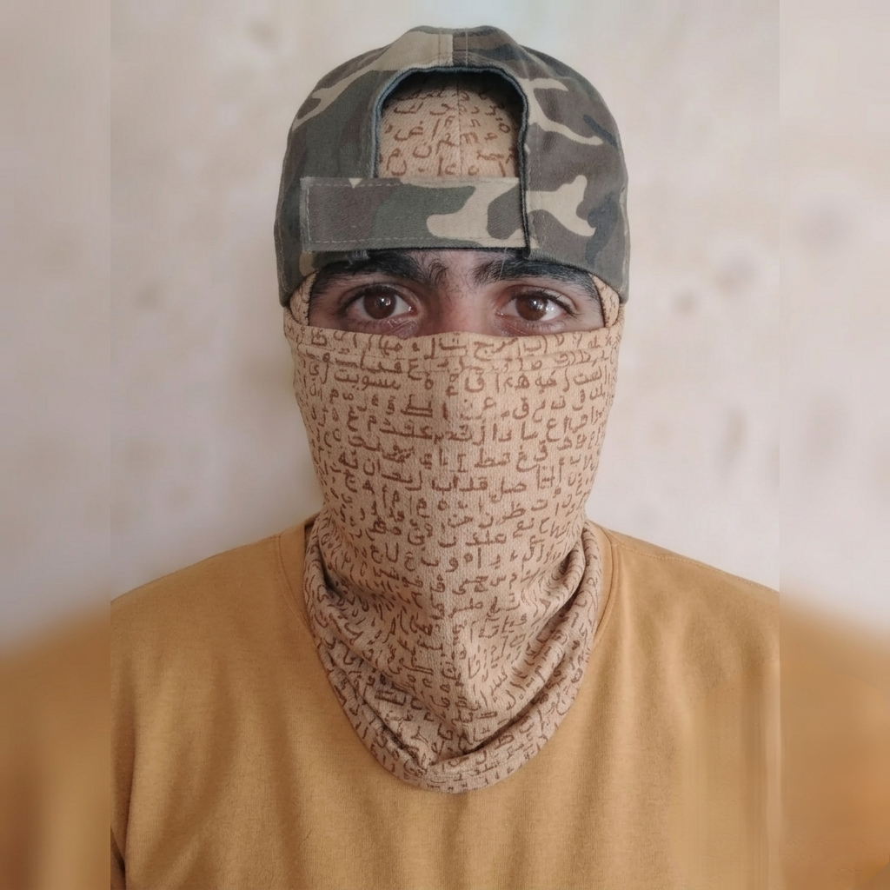

<html lang="ar" dir="rtl">
<head>
    <meta charset="UTF-8" />
    <meta name="viewport" content="width=device-width, initial-scale=1.0" />
    <title>RICK | Cyber Security Researcher</title>

    <link rel="preconnect" href="https://fonts.googleapis.com" />
    <link rel="preconnect" href="https://fonts.gstatic.com" crossorigin />
    <link href="https://fonts.googleapis.com/css2?family=Cairo:wght@300;400;700&display=swap" rel="stylesheet" />

    <link rel="stylesheet" href="https://cdnjs.cloudflare.com/ajax/libs/font-awesome/6.5.1/css/all.min.css" />

    
</head>
<body>

    <!-- ===== SECURITY CHECK ===== -->
    

        

            
> Initializing visitor integrity scan...

            
> Checking browser session structures...

            
> IP Routing Protocol: 172.217.16.14 verified.

            
> Injecting anti-bot token tracking...

            
> [SUCCESS] Cookies set. Access granted!

            

                🍪 Active Browser Cookie: None
            

        

    

    <!-- ===== HEADER (FIXED - NEVER HIDES) ===== -->
    <header id="mainHeader">
        

            

                
RICK

                

                    <i class="fa-solid fa-wifi"></i>
                    0
                    Kbps
                

                <button class="header-follow-btn" onclick="activateFollow()">[ Follow ]</button>
                <button class="header-users-btn" onclick="openUsersModal()"><i class="fa-solid fa-users"></i> [ المستخدمين ]</button>
                <button class="header-chat-btn" onclick="openChat()">
                    <i class="fa-solid fa-comment-dots"></i>
                    [ شات ]
                    0
                </button>
                <button class="nav-video-toggle" onclick="toggleView()">
                    <i class="fa-solid fa-video"></i> [ المقاطع ]
                </button>
            

            
<i class="fa-solid fa-bars"></i>

            <nav>
                <ul id="nav-list">
                    <li><a href="#home" onclick="resetToHome()">الرئيسية</a></li>
                    <li><a href="#about" onclick="resetToHome()">من أنا</a></li>
                    <li><a href="#services" onclick="resetToHome()">الخدمات</a></li>
                    <li><a href="#skills" onclick="resetToHome()">المهارات</a></li>
                    <li><a href="#contact" onclick="resetToHome()">اتصال</a></li>
                </ul>
            </nav>
        

    </header>

    <!-- ===== MAIN CONTENT (ORIGINAL) ===== -->
    

        <section id="home" class="hero">
            
            

                <h1>مرحباً، أنا Rick</h1>
                
>_ Cybersecurity Researcher & Ethical Hacker

                <a href="#contact" class="btn">اطلب فحص أمني الآن</a>
            

        </section>

        <section id="about">
            <h2 class="section-title">من أنا</h2>
            

                

                    
                

                

                    
أنا <strong>Rick</strong>، باحث متخصص في الأمن السيبراني.

                    
مرحباً بك في بوابتي الشخصية لتتبع وتحليل البيانات وفحص الأنظمة المتقدمة.

                

            

        </section>

        <section id="services">
            <h2 class="section-title">الخدمات الأمنية</h2>
            

                
<i class="fa-solid fa-network-wired"></i><h3>اختبار اختراق الشبكات</h3>
فحص شامل للشبكات الداخلية والخارجية للمؤسسات.

                
<i class="fa-solid fa-code-bug"></i><h3>فحص تطبيقات الويب</h3>
تحليل أمني دقيق للتطبيقات ومواقع الويب.

                
<i class="fa-solid fa-shield-halved"></i><h3>الاستجابة للحوادث</h3>
تقديم الدعم السريع وتأمين النظام مجدداً.

            

        </section>

        <section id="skills">
            <h2 class="section-title">المهارات والأدوات</h2>
            

                
<h3>أنظمة التشغيل</h3>
Linux (Kali / Parrot)

                
<h3>أدوات الفحص</h3>
Nmap / Burp Suite

                
<h3>الشبكات</h3>
TCP/IP / Canarytokens

            

        </section>

        <section id="contact">
            <h2 class="section-title">تواصل معي</h2>
            

                

                    <a href="https://www.tiktok.com/@rick_6000?_r=1&_t=ZS-97ujNamvHms" title="TikTok" target="_blank"><i class="fa-brands fa-tiktok"></i></a>
                    <a href="mailto:mmellouk586@gmail.com" title="Email"><i class="fa-solid fa-envelope"></i></a>
                

            

        </section>
    

    <!-- ===== VIDEO SECTION ===== -->
    <section id="video-section">
        <h2 class="section-title">المقاطع المنشورة</h2>
        

    </section>

    <!-- ===== CHAT MODAL ===== -->
    

        

            

                <h3><i class="fa-solid fa-comment-dots"></i> غرفة الشات</h3>
                

                     متصل
                

                <button class="chat-close-btn" onclick="closeChat()"><i class="fa-solid fa-xmark"></i></button>
            

            

                

                    <i class="fa-regular fa-comment"></i>
                    
لا توجد رسائل بعد ابدأ المحادثة الآن!

                

            

            

                الطرف الآخر يكتب
                ...
            

            

                

                    <input type="text" id="chatInput" placeholder="اكتب رسالتك..." onkeypress="if(event.key==='Enter') sendChatMessage()" />
                    <button class="preview-btn" onclick="previewTextMessage()" title="استماع للرسالة قبل الإرسال" style="background:rgba(255,255,255,0.2); backdrop-filter:blur(4px); border:1px solid var(--glass-border); border-radius:30px; padding:4px 12px; font-size:11px; cursor:pointer; color:var(--text-dark);">
                        <i class="fa-solid fa-ear-listen"></i> استماع
                    </button>
                

                <button class="voice-btn" id="voiceBtn" onclick="toggleRecording()" title="تسجيل رسالة صوتية">
                    <i class="fa-solid fa-microphone"></i>
                    
                </button>
                <button class="chat-send-btn" onclick="sendChatMessage()"><i class="fa-regular fa-paper-plane"></i> إرسال</button>
            

        

    

    <!-- ===== USERS MODAL ===== -->
    

        

            <h2><i class="fa-solid fa-user"></i> الملف الشخصي</h2>
            

                

                    <i class="fa-solid fa-user-secret"></i>
                

                
Rick

                

                    <i class="fa-regular fa-envelope"></i> mmellouk586@gmail.com
                

                

                    <i class="fa-solid fa-shield-halved" style="color: var(--accent);"></i>
                    باحث في الأمن السيبراني | متخصص في اختبار الاختراق
                

            

            

                <button class="profile-action-btn friend-btn" onclick="sendFriendRequest()">
                    <i class="fa-solid fa-user-plus"></i> طلب صداقة
                </button>
                <button class="profile-action-btn message-btn" onclick="toggleMessagePopup()">
                    <i class="fa-regular fa-paper-plane"></i> رسالة
                </button>
            

            

                <textarea id="messageText" placeholder="اكتب رسالتك هنا..."></textarea>
                <button class="send-msg-btn" onclick="sendMessage()">
                    <i class="fa-regular fa-paper-plane"></i> إرسال الرسالة
                </button>
            

            <button class="users-modal-close" onclick="closeUsersModal()">إغلاق</button>
        

    

    <!-- ===== LAB BUTTON (SMALLER) ===== -->
    <button class="lab-float-btn" id="openLabBtn"><i class="fa-solid fa-terminal"></i> [ Lab ]</button>

    <!-- ===== LAB MODAL ===== -->
    

        

            

                

                    

                    
Termux-SecLab v3.1

                

                

                    

                        
Welcome to Termux-SecLab. Type 'help' to see available commands.

                        

                            rick@seclab:~$
                            <input type="text" id="textCmd" class="term-input" autocomplete="off" autofocus />
                        

                    

                

            

        

    

    <!-- ===== AI CHATBOT (SMALLER) ===== -->
    <button class="ai-chatbot-toggle" id="aiChatToggle" title="اسأل المساعد الذكي">
        <i class="fa-regular fa-comment-dots"></i>
    </button>

    

        

            <h4><i class="fa-regular fa-message"></i> المساعد الذكي</h4>
            <button class="ai-chat-close" onclick="closeAiChat()"><i class="fa-solid fa-xmark"></i></button>
        

        

            

                مرحباً! أنا المساعد الذكي لموقع Rick. اسألني عن الخدمات، المهارات، أو أي شيء يتعلق بالأمن السيبراني.
                الآن
            

        

        

            <input type="text" id="aiChatInput" placeholder="اكتب سؤالك..." onkeypress="if(event.key==='Enter') sendAiMessage()" />
            <button onclick="sendAiMessage()"><i class="fa-regular fa-paper-plane"></i></button>
        

    

    <!-- ===== FOOTER ===== -->
    <footer>
        
&copy; 2026 Rick. جميع الحقوق محفوظة

        <a href="#privacy" class="privacy-link" onclick="alert('سياسة الخصوصية:\nنحن نحترم خصوصيتك بالكامل. جميع عمليات المحاكاة والفحص الأمني داخل هذا الموقع تجري محلياً في بيئة اختبار آمنة تماماً، ولا نقوم بجمع أو مشاركة أي بيانات حساسة تخص الزوار.')">سياسة الخصوصية</a>
    </footer>

    
</body>
</html>
